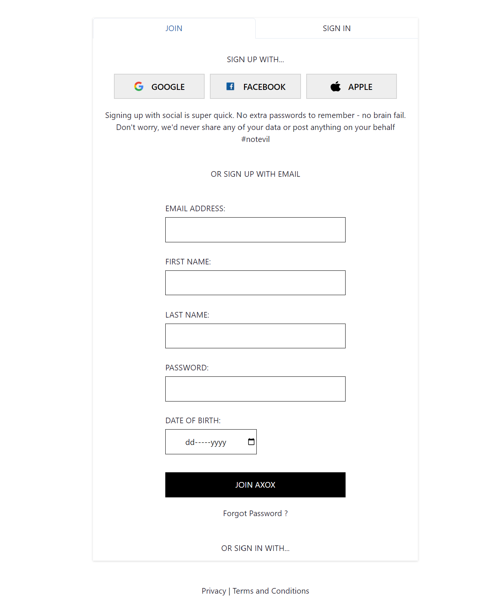
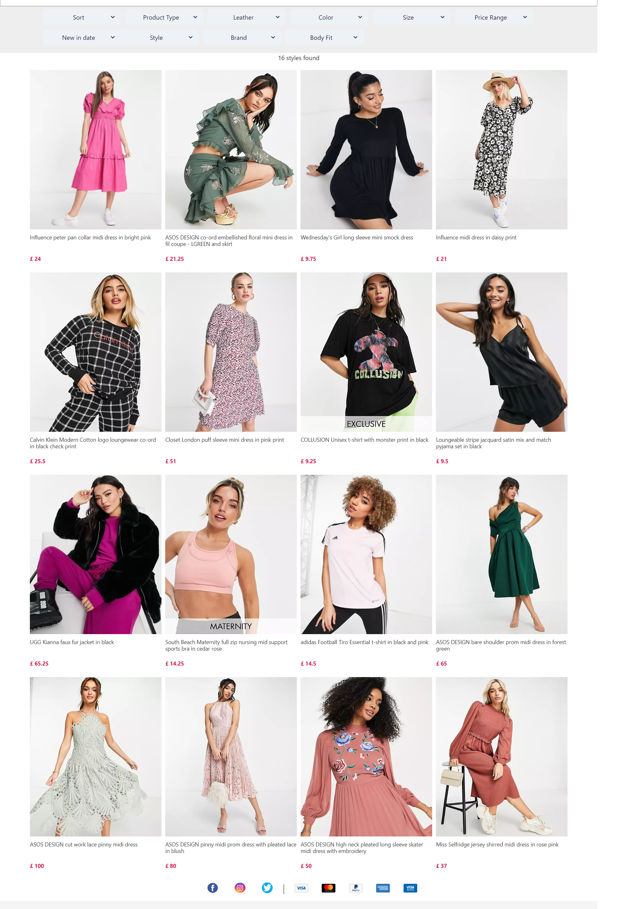
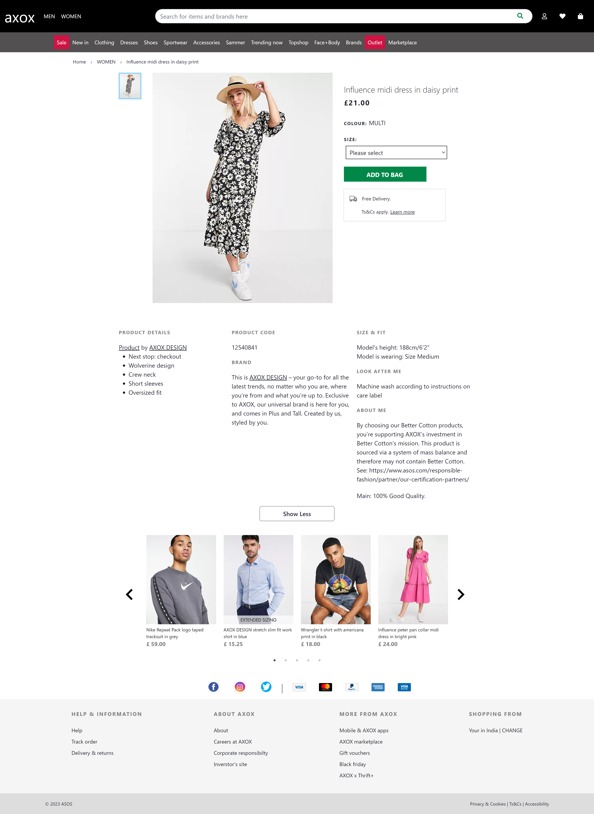
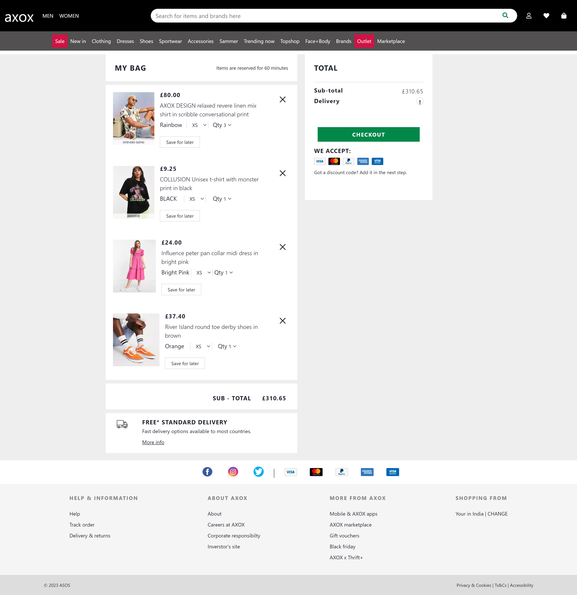
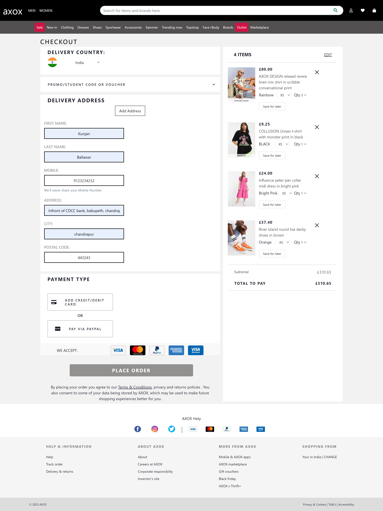
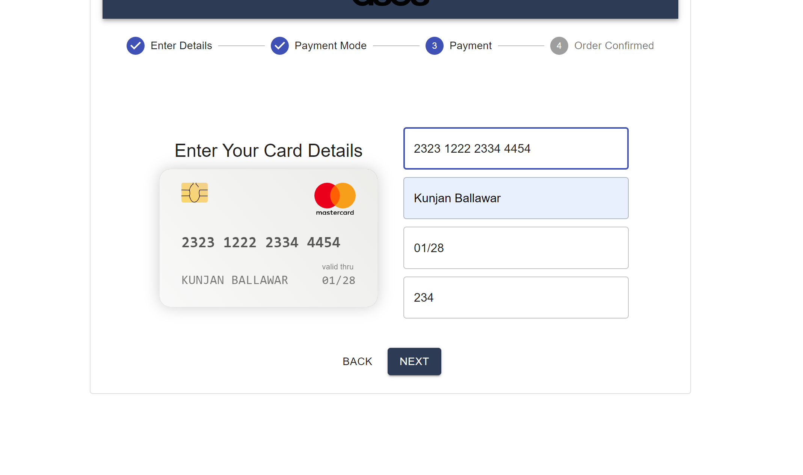

# ASOS

ASOS is a British online fashion and cosmetic retailer. The company was founded in 2000 in London, primarily aimed at young adults.

# AXOX (ASOS Clone)

This is the clone of ASOS website which we have done during our Unit 4 construct week at Masai. Its functional clone of this website. 
## Technologies used

- HTML
- Javascript
- CSS
- React
- Redux
- Chakra UI
- Json Server

## Functional things

- User signup page and login page with form validation and data managed with json server
- Home page
- 3 product pages with data managed with json server
- Sorting and Filtering functionality
- Cart Page with size & quantity updation
- Checkout page 
- Payment page with payment confirmation

## Netlify Link- https://animated-fudge-83fd4f.netlify.app/


## Run Locally

Pre-Requisite : 
VS Code

Clone the project

```bash
#   https://github.com/Kunjan0/civil-kettle-7397.git
#   run json server on local host on port 8080
```


## Website Flow

- Signup & Login pages


- Homepage, Men & Women pages 


- Product pages 


- Product Details & Cart pages 



-  Checkout and Payment pages


